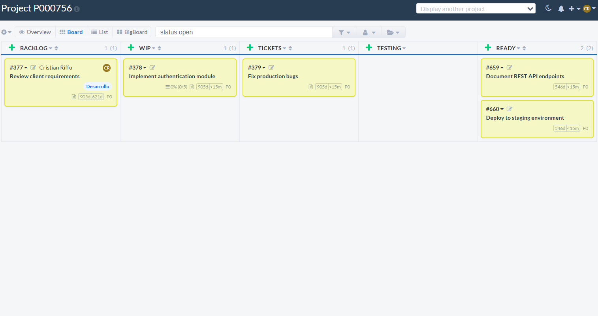
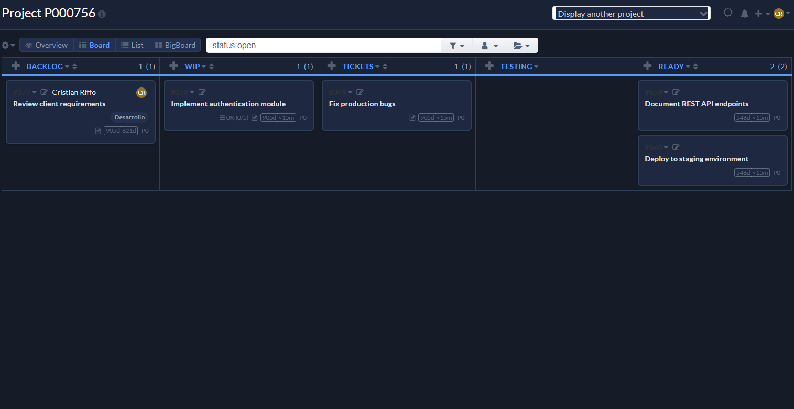
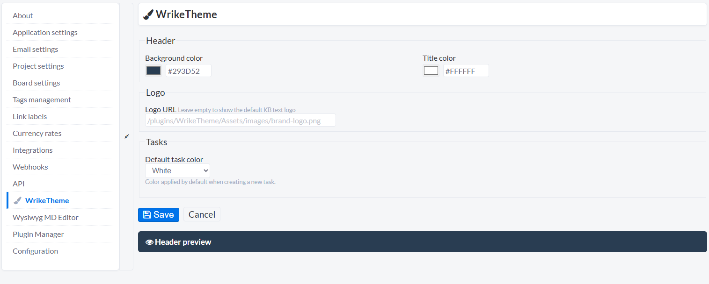

# WrikeTheme — Kanboard Plugin

A modern, minimalist theme for [Kanboard](https://kanboard.org) inspired by Wrike's clean project workspace aesthetic.  
Replaces Customizer, EssentialTheme, and Moon with a single self-contained plugin that includes syntax highlighting, a settings UI, per-user night mode, and login page branding.


---

## Screenshots

### Board — Light Mode


### Board — Night Mode


### Theme Settings


---

## Features

| Feature | Details |
|---|---|
| **Wrike-inspired palette** | Navy header `#293D52`, primary blue `#0073EA`, warm off-white `#F5F6F8` |
| **Night mode** | Toggle in the header bar — preference saved per-user in the database (no flash on reload, syncs across devices) |
| **Settings UI** | Configure logo, header color, title color, and default task color from within Kanboard Settings — no file editing required |
| **Login branding** | Logo and accent color applied to the login page |
| **White task color** | Adds a *White* option to the Default Task Color selector |
| **Default task color** | Set which color is pre-selected when creating a new task |
| **Syntax highlighting** | Prism.js included for Markdown code blocks |
| **Self-contained** | No dependency on Customizer, EssentialTheme, or Moon |

---

## Color Palette

| Token | Hex | Usage |
|---|---|---|
| Primary blue | `#0073EA` | Links, buttons, focus rings |
| Dark navy | `#293D52` | Default header background |
| Page background | `#F5F6F8` | App background |
| Card background | `#FFFFFF` | Task cards |
| Border | `#E6E9EF` | Dividers, input borders |
| Text primary | `#323338` | Body text |
| Text secondary | `#676879` | Metadata, icons |
| Success | `#00C875` | Completed tasks, positive states |
| Error | `#E44258` | Alerts, overdue dates |
| Tag chip | `#DCF0FF` / `#0073EA` | Task tag background / text |

**Night mode palette**

| Token | Hex | Usage |
|---|---|---|
| Page background | `#151C28` | Deep navy |
| Surface | `#1E2840` | Cards, sidebar, modals |
| Header | `#1A2236` | Top navigation bar |
| Border | `#2E3F58` | Dividers |
| Text primary | `#DDE3ED` | Body text |
| Accent | `#579BFC` | Links and interactive elements |

---

## Requirements

- Kanboard **≥ 1.0.48**
- PHP **≥ 7.2**

---

## Installation

1. Download or clone this repository into your Kanboard `plugins/` directory:

   ```bash
   cd /path/to/kanboard/plugins
   git clone https://github.com/porquero/WrikeTheme-for-Kanboard
   ```

2. If you were using **Customizer**, **EssentialTheme**, or **Moon** — disable them in  
   **Settings → Plugins** before enabling WrikeTheme to avoid CSS conflicts.

3. Enable **WrikeTheme** in **Settings → Plugins**.

4. Reload the page — the theme is applied immediately.

---

## Configuration

### Option A — Settings UI *(recommended)*

Navigate to **Settings → WrikeTheme** in the Kanboard sidebar.

From there you can set:

- **Header background color** — color picker + hex input with live preview
- **Header title color** — color picker + hex input
- **Logo URL** — any accessible URL; leave empty for the default `KB` text logo
- **Default task color** — pre-selects this color whenever a new task is created

All settings are saved to the Kanboard database and take effect immediately on the next page load.

### Option B — Config file

Edit the file at `data/files/WrikeTheme/config.php` (created automatically on first run):

```php
<?php
// Logo image path — comment out to use the default "KB" text logo
$themeWrikeConfig['logo'] = '/plugins/WrikeTheme/Assets/images/brand-logo.png';

// Header background color
$themeWrikeConfig['backgroundColorHeader'] = '#293D52';

// Header title color
$themeWrikeConfig['headingTitleColor'] = '#FFFFFF';
```

> **Note:** Settings saved via the UI take precedence over the config file when both are present.

---

## Night Mode

Click the **moon icon** (🌙) in the top-right header bar to toggle night mode.

- The preference is saved **per-user in the database** — it persists when switching browsers or devices.
- The correct mode is applied **server-side on page load**, so there is no flash of the wrong theme.
- For unauthenticated pages (e.g. the login screen), `localStorage` is used as a fallback.

---

## Syntax Highlighting

WrikeTheme bundles [Prism.js](https://prismjs.com/) for syntax highlighting inside Markdown code blocks on task descriptions and comments. No additional setup is needed.

````markdown
```python
def hello():
    print("Hello, Kanboard!")
```
````

---

## Replacing Legacy Plugins

WrikeTheme was built by studying the source code and architecture of three existing Kanboard plugins, which served as direct references and inspiration:

| Legacy plugin | What was referenced |
|---|---|
| **[Customizer](https://github.com/creecros/Customizer)** | Logo injection, header color config, login branding approach, settings UI pattern |
| **[EssentialTheme](https://github.com/JamesEadon/EssentialTheme)** | Full CSS theme structure and Kanboard selector conventions |
| **[Moon](https://github.com/functionland/moon)** | Prism.js integration, logo in header, config-file-based theming, layout template overrides |

WrikeTheme combines all of their features into a single self-contained plugin — disable all three before enabling WrikeTheme to avoid CSS conflicts.

---

## File Structure

```
WrikeTheme/
├── Plugin.php                          # Hook registration, routes, color hook
├── config.php                          # Default config (copied to data/files/ on first run)
├── Controller/
│   └── WrikeThemeController.php        # Settings page, save, night mode toggle
├── Template/
│   ├── layout.php                      # Main layout (night mode class on <body>)
│   ├── header.php                      # Header with night mode toggle button
│   ├── auth/
│   │   └── login_header.php            # Login page branding
│   ├── config/
│   │   ├── sidebar.php                 # Settings sidebar link
│   │   └── settings.php               # Settings form
│   └── layout/header/
│       └── title.php                   # Logo + page title
└── Assets/
    ├── css/
    │   ├── wrike.css                   # Full theme (light + night mode)
    │   └── prism.css                   # Syntax highlighting styles
    ├── js/
    │   ├── wrike.js                    # Night mode toggle, back-to-top
    │   ├── prism.js                    # Syntax highlighting engine
    │   └── clipboard.min.js            # Clipboard utility
    └── images/
        └── brand-logo.png              # Default logo
```

---

## Changelog

### 1.1.2
- **Fix:** Night mode now persists correctly across page navigations. Root cause: the DB write failure (see 1.1.1) caused `layout.php` to output `data-night-mode="0"`, which the JS then used to overwrite `localStorage`, destroying the only remaining client-side fallback. Fix: JS now also writes a cookie (`wrikeThemeNightMode`) on every toggle. `layout.php` reads the cookie first — bypassing the DB entirely for same-browser persistence. The DB write (AJAX) remains as a best-effort layer for cross-device sync.

### 1.1.1
- **Fix:** Night mode preference now saves correctly on PHP 8.3 + SQLite. Kanboard's `MetadataModel::save()` calls `exists()` internally, which returns `true` on an empty table under PHP 8.3, causing silent `UPDATE` failures. `toggleNight()` now uses raw PicoDb `COUNT` + conditional `INSERT`/`UPDATE` to bypass the broken code path.

### 1.1.0
- Added Settings UI page (Settings → WrikeTheme) — configure logo, colors, and default task color without editing files
- Night mode preference now saved per-user in the database — no more flash on reload, syncs across devices
- Login page branding — logo and accent color applied to the login screen
- Default task color hook — configurable pre-selected color for new tasks
- Plugin version bumped to 1.1.0

### 1.0.0
- Initial release
- Wrike-inspired color palette (light mode)
- Night mode with localStorage persistence and OS preference fallback
- Prism.js syntax highlighting
- White task color option
- Back-to-top button

---

## License

MIT — see [LICENSE](LICENSE) for details.

---

## Credits

- Built with [Claude](https://claude.ai) by [Anthropic](https://www.anthropic.com)
- Reference plugins: [Customizer](https://github.com/creecros/Customizer), [EssentialTheme](https://github.com/JamesEadon/EssentialTheme), [Moon](https://github.com/functionland/moon)
- Syntax highlighting: [Prism.js](https://prismjs.com/) by Lea Verou
- Color system inspired by [Wrike](https://www.wrike.com)
- Plugin architecture based on the [Kanboard Plugin Guide](https://docs.kanboard.org/en/latest/plugins/index.html)
